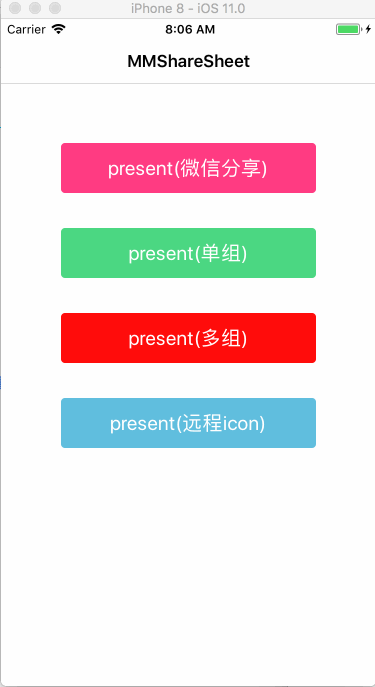
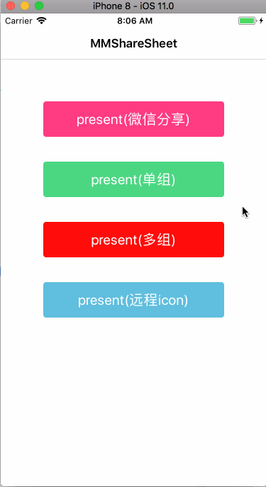
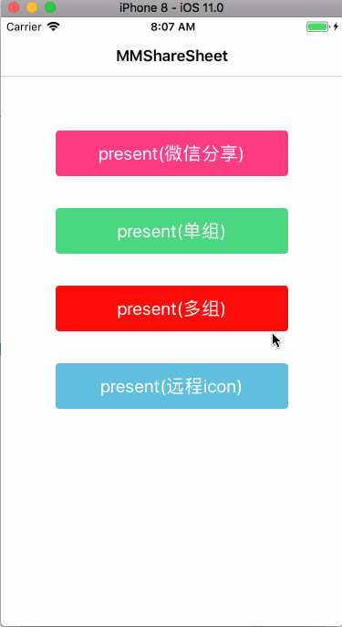
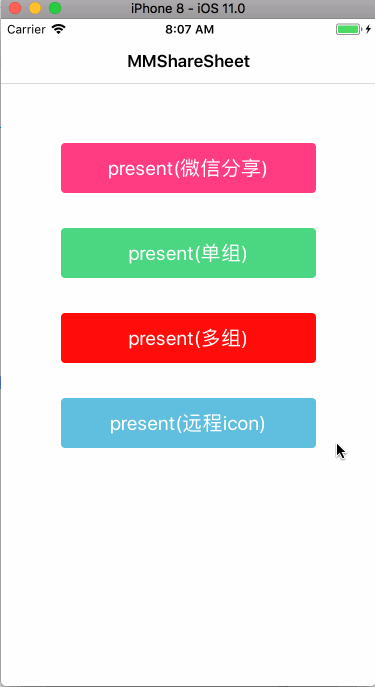

## MMShareSheet


[](https://cocoapods.org/pods/MMShareSheet) 
[](https://github.com/MinMao-Hub/MMShareSheet)
[](https://cocoapods.org/pods/MMShareSheet) 
[](https://github.com/MinMao-Hub/MMShareSheet)
[](http://opensource.org/licenses/MIT)

### Introduction

MMShareSheet 是一个简单的弹出选择框，使用纯swift编写，类似于微信(或支付宝)里面的分享(朋友圈打开网页右上角分享)控件

MMShareSheet is an simple pop-up selection box(ShareSheet) written in pure Swift. Similar to the wechat(or airpay) actionsheet share-UIKit

### Rquirements

* iOS 8.0+
* Xcode 9 (swift 4)
* Xcode 8 (swift 3) 
	* If you want to run demo in swift3, please switch branch to swift3.0

### Installation


#### Install with  Cocoapods

* `pod 'MMShareSheet', '~> 0.0'`
* `import MMShareSheet `  in you code


#### Copy code into project

[克隆代码](https://github.com/MinMao-Hub/MMShareSheet.git)，然后将components文件夹下面的两个文件 `MMShareSheet.swift` 和 `MMCardItem.swift`加入到你的项目中即可。	

Just clone and add `MMShareSheet.swift`, `MMCardItem.swift` to your project.

### Example

> 1. 【类似于微信分享】- Similar to WeChat share
> 
> 2. 【单组cards】- Single group cards(显示组数完全取决于传入的cards数组)
> 
> 3. 【多组cards】- Multi group cards
> 
> 4. 【支持远程icon】- Support remote Icon

<div>
	
	
</div>
<div style="margin-top: 30px">
	
	
</div>


### Usage

```swift
let cards = [
    [
        [
            "title": "微信好友",
            "icon": "wechat",
            "handler": "wxfriend"
        ],[
            "title": "微信朋友圈",
            "icon": "moment",
            "handler": "wxmoment"
        ],[
            "title": "QQ好友",
            "icon": "qq",
            "handler": "qqfriend",
        ],[
            "title": "支付宝",
            "icon": "airpay",
            "handler": "airpay",
        ],[
            "title": "新浪微博",
            "icon": "sina",
            "handler": "sinawb",
        ]
    ],[
        [
            "title": "拷贝",
            "icon": "copy_link",
            "handler": "copy"
        ],[
            "title": "在Safari中打开",
            "icon": "safari",
            "handler": "safari"
        ],[
            "title": "收藏",
            "icon": "collection",
            "handler": "collect",
        ],[
            "title": "刷新",
            "icon": "refresh_icon",
            "handler": "refresh",
        ],[
            "title": "举报",
            "icon": "jubao",
            "handler": "report",
        ]
    ]
]
    
let cancelBtn = [
    "title": "取消",
    "handler": "cancel",
    "type": "default",
]
let mmShareSheet = MMShareSheet.init(title: "此网页由wx.keeponrunning.com提供", cards: cards, duration: nil, cancelBtn: cancelBtn)
mmShareSheet.callBack = { (handler) ->() in
    print(handler)
}
mmShareSheet.present()

```

*PS:注释*

* create sharesheet && init 【创建并初始化】

`MMShareSheet.init(title: "此网页由wx.keeponrunning.com提供", cards: cards, duration: nil, cancelBtn: cancelBtn)`

* argument【参数描述】
 
	* `title` 头部标题
	* `cards ` 事件按钮数组，类型为`Array<Array<Dictionary<String, String>>>`，里面包含每一行卡片组`Array<Dictionary<String, String>>`，每一行卡片里面又包含item<Dictionary<String, String>>：
		
		```
		[
	        "title": "拍照",
	        "icon": "wechat"
	        "handler": "camera",
	    ]
		```
		* `title`   item标题
		* `icon `   item图标，可以是本地图片名或者远程图片链接
		* `handler` item事件唯一标识，回调的时候根据该值区别处理事件
	* `duration ` 动画时长
	* `cancelBtn `   取消按钮属性，类型为`<Dictionary<String, String>`；若设置为`nil`则无该按钮, 必须要设置某一个属性，默认值为`[
    "title": "取消", "handler": "cancel","type": "default"]`
* callback【回调】

```
mmShareSheet.callBack = { (handler) ->() in
	print(handler)
}
```
 `handler` 该handler即为cards里面item的`handler`，对应的回调过来

* present【弹出sharesheet】

`mmShareSheet.present()`

### Other

另外介绍一套由我朋友开发的组件库[keeponrunning/wxui](https://github.com/keeponrunning/wxui), 该组件库基于阿里weex开发，轻量、简单、易集成；里面包含丰富的常用组件，完美适配android和iOS，使用weex开发的朋友们多多关注哈，喜欢的朋友添加QQ群(710853476)讨论【群里有web前端大神支持哦😯】。


### Contribution

You are welcome to fork and submit pull requests.

### License

MMShareSheet is open-sourced software licensed under the MIT license.
